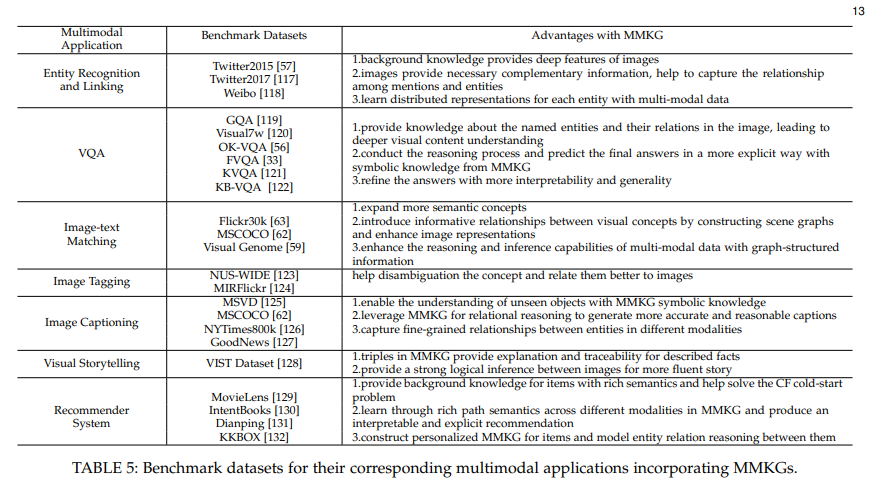

# 多模态知识图谱概述

## 1. 产生的起因

*   现有的大多数知识图都是用纯符号以文本的形式表示的，这削弱了机器描述和理解现实世界的能力。如果没有与狗生活在一起的经历，人类就无法理解狗是什么。

*   将符号形式与非符号体验联系起来，有助于获得真正的交际意图。例如，客户可以在没有穿马甲经验的情况下，不理解穿马甲作为一种特殊姿势（手在衣盖内）的含义，因此，有必要将符号接地到相应的图像、声音和视频数据中，并将符号映射到它们在物理世界中具有意义的相应参照物中，使机器能够产生与真实人类类似的“体验”。

*   为了突破现实世界应用的瓶颈，人们对知识的多模态需求越来越大。例如，在关系提取任务中，附加图像通常会极大地提高提取属性和关系的性能，这些属性和关系在视觉上很明显，但在符号和文本中很难识别，例如部分（例如，键盘和屏幕是笔记本电脑的一部分）和颜色（例如香蕉通常是黄色或黄绿色，但不是蓝色）。在文本生成任务中，如果机器已被授权通过参考多模态KG（MMKG）识别图像中的特定实体，该机器可以生成信息量更大的实体级句子（例如唐纳德·特朗普正在演讲），而不是模糊的概念级描述（例如一个金发的高个子男人正在演讲）。

## 2. 构建分类（Construction）

### 2.1 从图像到符号（from images to symbols），即用KG表示符号来标注图像

#### 2.1.1视觉实体/概念提取

视觉实体（或概念）提取的目的是检测和定位图像中的目标视觉对象，然后用实体（或概念）符号标记这些对象。这项任务的主要挑战在于如何在没有大规模、细粒度、注释良好的概念和实体图像数据集的情况下学习有效的细粒度提取模型。尽管CV中有丰富的注释良好的图像数据，但这些数据集几乎都是粗粒度的概念图像，无法满足MMKG构造对细粒度概念和实体的图像注释数据的要求。现有的视觉实体/概念提取方法大致可分为两类：1）对象识别方法，该方法标记视觉实体/概念，通过对检测对象的区域进行分类；2）视觉基础方法，通过将标题中的单词或短语映射到最相关的区域来标记视觉实体/概念。

#### 2.1.2视觉关系提取

视觉关系提取的目的是识别图像中检测到的视觉实体（或概念）之间的语义关系，然后用KGs中的关系标记它们。尽管视觉关系检测在CV社区中得到了广泛的研究，但大多数检测到的关系都是视觉对象（如人、站在上面、海滩）之间的表面视觉关系。不同的是，为了构建MMKG，视觉关系提取任务旨在识别KG中定义的更一般类型的语义关系，例如（杰克、配偶、罗斯）。现有的视觉关系提取方法大致可以分为基于规则的关系提取和基于统计的关系提取两大类。其他一些工作主要集中在长尾关系和细粒度关系上。

#### 2.1.3 视觉事件提取

事件通常被定义为参数之间的动态交互,包括一个触发器和几个参数及其相应的参数角色。触发器是表示事件发生的动词或名词，参数角色是指事件与参数之间的语义关系，如时间、人和地点，参数是实体提及、概念或属性值。传统的事件提取任务旨在通过触发器预测事件类型，然后根据预定义的事件模式提取其参数。同样，视觉事件提取也可以分为两个子任务：1）预测视觉事件类型；2）定位并提取源图像或视频中的对象作为视觉参数。这项任务有几个挑战：1） 视觉事件提取需要为不同的事件类型预先定义模式，但大量视觉事件尚未由专家定义。如何自动挖掘视觉模式作为事件模式？2） 如何从图像或视频中提取视觉事件的视觉参数？现有的视觉事件提取工作主要集中在两个方面：1）视觉事件模式挖掘，它将最相关的视觉实体（或概念）检测并标记为新模式；2） visual event arguments extraction，根据事件模式从可视数据中提取参数角色区域。

### 2.2 从符号到图像（ from symbols to images），即把KG中的符号对应到图像。

#### 2.2.1实体接地

实体接地旨在将KGs中的实体接地到其相应的多模态数据，如图像、视频和音频。现有的工作主要侧重于将实体与相应的图像联系起来。实体接地到图像的主要挑战如下：1）如何以低成本为实体找到足够的高质量图像？2） 如何从大量噪声中选择与实体最匹配的图像？有两个主要来源可以找到实体的图像：（1）来自在线百科全书（如维基百科）和（2）通过网络搜索引擎从互联网。

#### 2.2.2 概念基础

概念基础旨在为视觉概念寻找具有代表性、有区别性和多样性的图像。其他概念的符号基础面临着新的挑战：1）并不是所有的概念都能正确地可视化。例如，非宗教主义者不能基于某个特定的形象。如何区分可视概念和非可视概念？2） 如何从一组相关图像中找到一个可视化概念的代表性图像？请注意，可视化概念的图像可能非常多样。例如，说到公主，人们经常会想到几个不同的形象，比如迪士尼公主、历史电影中的古代公主或新闻中的现代公主。因此，我们必须考虑图像的多样性。为了应对上述挑战，相关研究分为三个任务：可视化概念判断、代表性图像选择和图像多样化。

#### 2.2.3 关系基础

关系基础是从图像数据语料库或互联网上找到可以代表特定关系的图像。输入可以是该关系的一个或多个三元组，输出应该是该关系最具代表性的图像。当我们使用三元组作为查询来检索关系的图像时，排名靠前的图像通常与三元组的主语和宾语更相关，但与关系本身无关。如何找到能够反映输入三元组语义关系的图像？现有的关系基础研究主要集中在空间或动作关系上，如左的、上的、骑的和吃的。

## 3. 应用分类（Application）

### 3.1 In-MMKG应用，目的是解决MMKG本身的质量或集成问题

#### 3.1.1 链路预测

&#x20;MMKG中的链路预测，当h，r，t中的一个实体缺失时，即在（？，r，t）中预测h或在（h，r，，）中预测t，目的是完成一个三元组（h，r，t）。

#### 3.1.2 三元组分类

三元组分类的目的是区分正确的三元组和错误的三元组，这也可以看作是一种KG完成任务。基于在MMKG上学习的嵌入模型，每个三元组可以用一个能量得分E（h，r，t）。为每个关系r设置不同的阈值δr，如果一个三元组的能量分数高于δr，则该三元组将被预测为负。为了为分类模型准备训练数据，通过替换h、r、t中的一个来损坏正确的三元组以生成负数据。

#### 3.1.3 实体分类

实体分类将实体分类为不同的语义类别，即MMKG中不同粒度的概念。实体分类也可以被视为一个特殊的链接预测任务，其中关系被设置为IsA，等待预测的三元组的尾部是MMKG中的一个概念。针对传统的KG提出了各种实体分类模型，这些模型也可用于MMKG。但是，如果没有一个好的MMKG嵌入模型，MMKG中实体和概念的丰富多模态数据就无法充分利用。例如，一些努力从几种不同类型的模式学习实体和概念的嵌入，然后将它们编码到联合表示空间。

#### 3.1.4 实体对齐

实体对齐用于对齐在不同MMKG中引用相同真实身份的实体。当两个MMKG之间存在重叠时，将它们整合为一个是可行的方法。其核心思想是学习不同KG中实体的表示，然后评估两个KG之间每个实体对之间的相似性。在两个传统KG之间的实体嵌入中使用的功能包括KG内的上下文信息（例如OWL属性的语义、邻域的共现、兼容的属性值）和外部信息（例如外部词典和维基百科链接）。

### 3.2 Out-of-MMKG，不限于MMKG范围内，但可以由MMKG协助。

#### 3.2.1 多模态实体识别与连接

基于纯文本的命名实体识别（NER）已经得到了广泛的研究。实体提及的模糊性和多样性一直是关键挑战。最近的工作考虑使用NER从带有图像的文本中检测实体，定义为多模态NER（MNER）, ,图像可以为实体识别提供必要的补充信息。MMKG通过提供视觉特征来描述不同类型的实体，在MNER中发挥着重要作用，因此MNER模型可以更好地利用与文本相连的图像的视觉特征进行实体识别。

#### 3.2.2 视觉问答

视觉问答是一项具有挑战性的任务，它不仅需要对问题进行准确的语义分析，还需要深入理解给定图像中不同对象和场景之间的相关性。在大多数最近的VQA基准数据集中，比如GQA,OK-VQA和KVQA,许多问题需要视觉推理与外部知识相结合。新提出的VQA任务弥补了人类可以轻松地将各种模式的知识结合起来回答视觉查询这一差异。例如，在问题“哪位美国总统与这里看到的毛绒玩具有关？”，如果图像中的毛绒玩具被检测为“泰迪熊”，那么通过KG推断出的答案将是“西奥多·罗斯福”，他通常被称为“泰迪·罗斯福”，泰迪熊就是以他的名字命名的。

#### 3.2.3 图文匹配

图像文本匹配是许多文本和图像相关应用（如图像文本和文本图像检索）中的一项基本任务，其目的是输出输入图像和文本对之间的语义相似性分数

#### 3.2.4 多模态生成任务

有几个研究的多模式生成任务，如图像标记、图像字幕、视觉故事讲述等，可以从MMKG中受益。

#### 3.2.5 多模式推荐系统

推荐系统旨在通过对历史数据的分析，推荐用户可能喜欢/购买的物品。在这个过程中，需要平衡各种因素，如准确性、新颖性、分散性和稳定性。当推荐场景中存在图像和文本等多模态数据时，我们称之为多模态推荐系统，不同模态的信息应联合使用。将MMKG的信息整合到不同的模式中，有助于解决基于协同过滤（CF）的推荐策略中长期存在的冷启动问题。其他一些方法可以找到其他方法来利用MMKG获得更个性化、更可解释的建议。

## 3. 多模态知识图谱的好处

尽管已经有很多人在使用多模态学习技术和多模态预训练语言模型处理各种多模态任务方面做出了努力，但引入多模态知识以帮助提高现有多模态任务的性能仍然是一种新兴趋势。总的来说，MMKG可以从以下几个方面受益于这些下游任务。

*   MMKG提供了足够的背景知识来丰富实体和概念的表示，特别是对于长尾问题，引入辅助的常识知识可以增强图像和文本的表示能力。

*   MMKG能够理解图像中不可见的物体。这主要是利用符号知识提供的在视觉上看不见物体的符号信息，或在看不见物体和看不见物体之间建立语义关系。

*   MMKG支持多模态推理。在外部知识资源的帮助下，VQA任务的推理能力可以得到提升。

*   MMKG通常提供多模态数据作为附加特性来弥补一些NLP任务中的信息差距。以实体识别为例，一个图像可以提供足够的信息来识别“Rocky”是一只狗的名字还是一个人的名字。

## 4. 不足

### 4.1 复杂符号知识基础

除了实体、概念和关系的基础之外，一些下游应用还需要复杂符号知识的基础，这些知识由多个相互之间具有密切语义关系的关系事实组成。多重关系基础具有挑战性，因为它涉及多个关系的基础，而这些多重基础通常以复杂的方式相互交错。我们必须找到充分体现复合语义关系的图像。在许多情况下，复合语义只是隐式表达的，可能会随着时间的推移而改变。

### 4.2 质量控制

通常，我们依靠数据驱动的方法来构建大规模MMKG。自动从大数据中获取的MMKG不可避免地会遇到质量问题，即MMKG可能包含错误、缺失事实或过时事实。例如，在基于搜索行为数据的多模态知识获取中，很容易将错误的图像与长尾实体相关联，因为此类实体可能在Web上没有图像，因此任何单击的图像都会导致错误的接地。

### 4.3 效率

在建造大型KG时，效率始终是一个不可忽视的问题。构建MMKG的效率问题更为突出，因为需要考虑处理多媒体数据的额外复杂性如果基础目标是视频数据，那么可伸缩性问题甚至可能会被放大。
