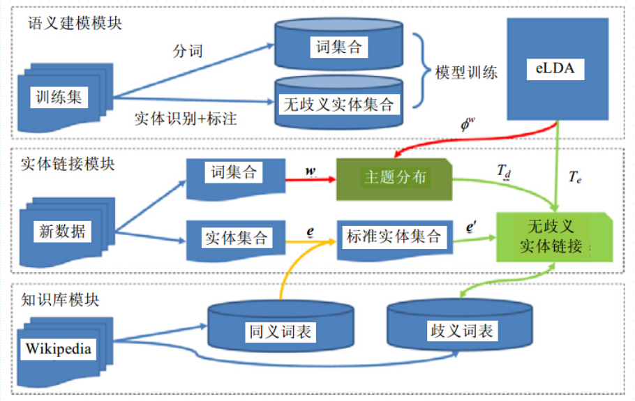
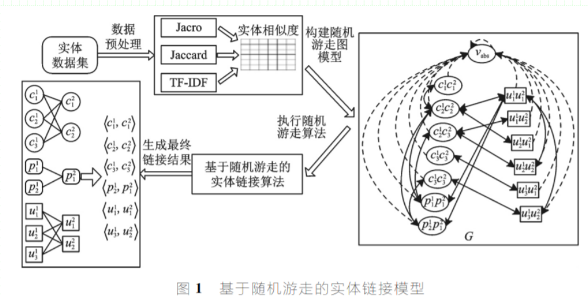
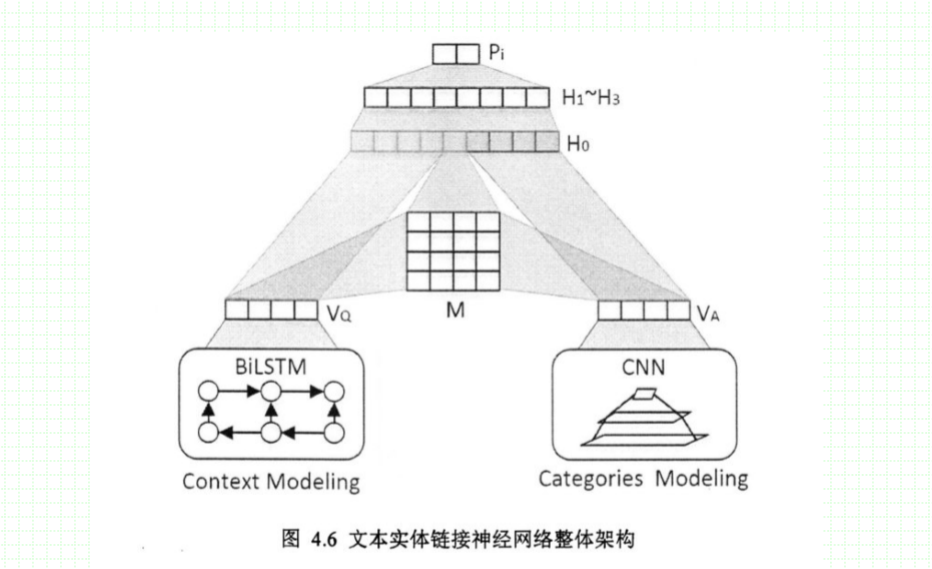
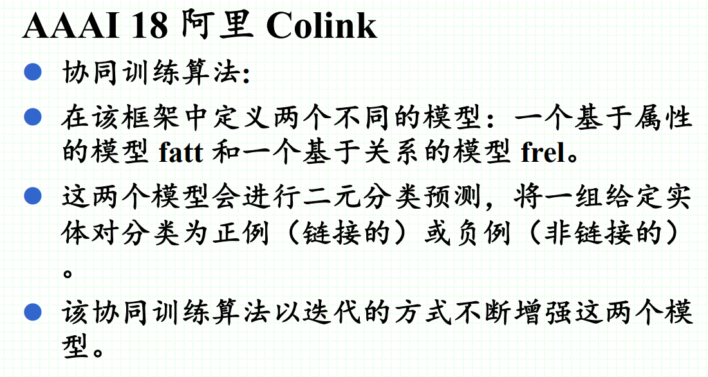

# 实体链接

## 1. 什么是实体链接

实体链接是指将文档中出现的文本片段，即实体指称（Entity Mention）链向其所在特定知识库（Knowledge Base）中相应条目的过程。

## 2. 实体消歧步骤

*   命名实体识别

*   词义消歧

## 3. 实体链接方法

### 3.1 基于概率生成模型的方法

原理根据：提出实体-提及模型根据实体的知名度、名字分布、上下文分布等异构知识来进行实体链接

*   一个实体的名字通常是固定的，且以一定的概率出现

*   指称的上下文与实体越匹配，则越可能链接到对应实体

*   利用M\&W相似度可以计算出候选实体与上下文中其他实体的相关性

    

### 3.2 基于主题模型的方法

强假设：同一篇文本中的实体应当与文本的主题相关

### 3.3 基于图的方法

*   重启随机游走（CRF条件随机场）

    

*   实体相似度计算：根据实体属性值的数据类型使用不同相似度计算方法来度量它们之间的相似性，再使用聚合函数初始化实体间的相似度矩阵。

*   图模型构建：根据实体类型，基于相似度计算确定候选实体，并作为关联图中的顶点，再基于实体间的语义关系，确定候选链接单元间的关联。

### 3.4 基于深度学习的方法

*   使用CNN、BILSTM等

    

### 3.5 无监督的方法

