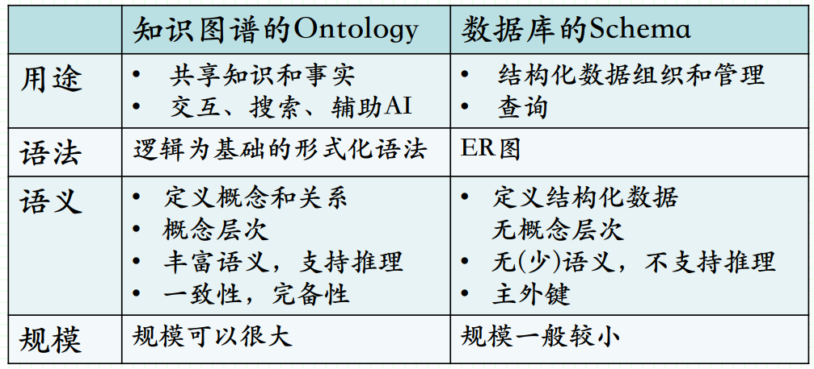
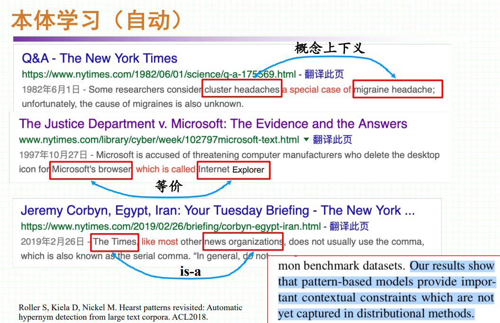
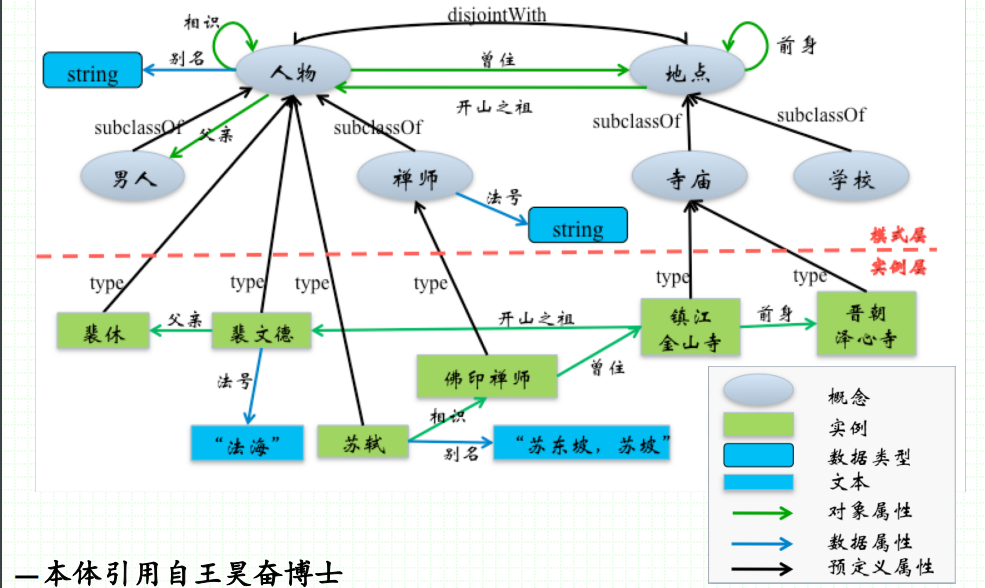

# 知识建模

## 1. 本体（Ontology）

- 本体是人类根据认知对世界的一个知识体系总结和描述。人类探索知识就是在不断摸索，推测这个知识体系的过程，人类的认知注定这个知识体系永远达不到完美。
- 本体是我们告诉计算机人类如何认识和理解世界万物的一种形式化描述方式。
- 本体是领域共享知识的描述方式，是语义Web，知识工程和很多人工智能应用的基础。
- 本体成为语义网知识描述的载体，语义网的研究热潮促进了本体的研究。
## 2. 知识建模方法

### 2.1 本体工程

- 知识图谱需要一个本体来形式化界定和描述它所描述的知识和事实的范围
- 本体工程是用工程化规范来保证本体质量的方法学
### 2.2 知识图谱本体 vs 数据库模式

### 2.3 本体构建工程（手工）

七步法：[https://protege.stanford.edu/publications/ontology_development/ontology101.pdf](https://protege.stanford.edu/publications/ontology_development/ontology101.pdf)

- Step1 确定本体的领域和范围
- Step2 考虑重用现在本体
- Step3 列出本体中的重要术语
- Step4 定义类和类的继承
	- 确保类的继承正确
	- 分析类继承结构中的兄弟类
	- 引入新类的时机
	- 新类或属性值的取舍
	- 实例或类的取舍
	- 范围限制
	- 不相交的子类-
- Step5  定义属性和关系
	- 逆属性/关系
	- 缺省属性值
- Step6 定义属性的限制
- Step7 创建实例
### 2.4 本体学习（自动）
- 方法一：基于规则的本体学习
	- 人工写模板规则抽取实体
	- 优点：利用专家知识写抽取模板
	- 缺点：规则不足、规则冲突、不好扩展
	
- 方法二：基于机器学习的本体学习
	- 转化为机器学习中的分类和序列标注问题
	- 优点：效率高，自动化
	- 缺点：学习模型通用性和学习效果存在矛盾

## 3. 基于Protege的知识建模

## 4. 知识图谱中的知识建模

- 知识图谱中包含本体曾和实例层，本体通常手工构建，实例通常自动化抽取。
- 构建本体目的是确定知识图谱能描述的知识
- 不一定需要本体的形式表示
- 不一定需要Protege等专业建模软件
- 本体是给知识图谱实施者使用，通过它来确定知识抽取的范围、推理规则和构建查询等
