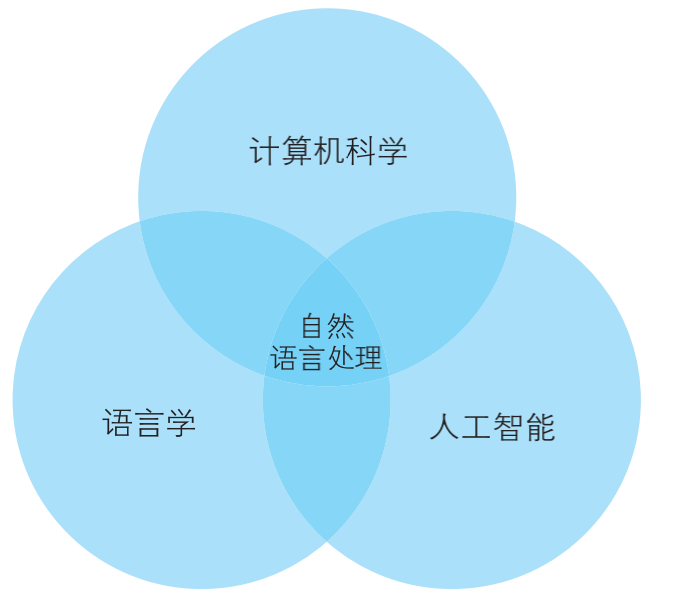

# NLP概述

## 1. NLP基础

### 1.1 什么是NLP？

- **自然语言处理**(Natural Language Processing，NLP)是一门融合了计算机科学、人工智能及语言学的交叉学科。这门学科研究的是如何通过机器学习等技术，让计算机学会处理人类语言，乃至实现终极目标--理解人类语言或人工智能，达到人与机器之间进行有效交流。
- NLP主要可以分为：自然语言处理（理解文本）和自然语言生成（生成文本）
### 1.2 自然语言的特点
- 词汇量：丰富
- 非结构化：无规则，变化多
- 歧义性：含有大量歧义，一词多义，多词同义
- 容错性：日常文本含有大量语法错误
- 易变性：容易演化变更出未登录词
- 简略性：往往简洁干练
### 1.2 NLP研究任务
- 机器翻译
- 情感分析
- 智能问答
- 文摘生成
- 文本分类 
- 舆论分析
- 知识图谱
### 1.3 NLP基本术语及层次

从低到高：

1. 语音、图像和文本
2. 分词、词性标注、命名实体识别
3. 句法分析、指代消解
4. 信息抽取
5. 文本分类、文本聚类
6. 问答系统、自动摘要、机器翻译
### 1.5 NLP流派
1. **基于规则的专家系**
- 规则，指的是由专家手工制定的确定性流程。专家系统要求设计者对所处理的问题具备深入的理解，并且尽量以人力全面考虑所有可能的情况。它最大的弱点是难以拓展。当规则数量增加或者多个专家维护同一个系统时，就容易出现冲突。

2. **基于统计的学习方法**

- 人们使用统计方法让计算机自动学习语言。所谓“**统计**”，指的是在语料库上进行的统计。所谓“**语料库**”，指的是人工标注的结构化文本。
- 统计学习方法其实是机器学习的别称，而机器学习则是当代实现人工智能的主要途径。

**3. 基于深度学习的大规模模型方法**

- 人们采用深度学习网络自动挖掘大规模的高质量数据中的潜在语义特征，进而学习语言。
### 1.6 语料库概念
- **中文分词**语料库
- **词性标注**语料库
- **命名实体识别**语料库
- **句法分析**语料库
- **文本分类**语料库
- 语料库的建设
	语料库建设指的是构建一份语料库的过程，分为规范制定、人员培训与人工标注这三个阶段。针对不同类型的任务，人们开发出许多标注软件，其中比较成熟的一款是brat，它支持词性标注、命名实体识别和句法分析等任务。

### 1.7 常用开源工具

-  HanLP
-  LTP
-  NLTK
-  CoreNLP

## 2. NLP发展史

### **2001 - Neural language models（神经语言模型）**

- Bengio等人在2001年提出的前馈[神经网络](https://so.csdn.net/so/search?q=神经网络&spm=1001.2101.3001.7020) 

### **2008 - Multi-task learning（多任务学习：多个任务上训练的模型之间共享参数的一种通用方法）**

- 多任务学习的概念最初由Rich Caruana 在1993年提出，并被应用于道路跟踪和肺炎预测（Caruana,1998）
- 2008年，Collobert 和 Weston 将多任务学习首次应用于 NLP 的神经网络。在他们的模型中，查询表（或单词嵌入矩阵）在两个接受不同任务训练的模型之间共享

### **2013 - Word embeddings（词嵌入：使用密集向量表示词或词嵌入）**

- Mikolov等人在2013年提出的创新技术是通过去除隐藏层，逼近目标，进而使这些单词嵌入的训练更加高效，虽然这些嵌入在概念上与使用前馈神经网络学习的嵌入在概念上没有区别，但是在一个非常大的语料库上训练之后，它们就能够捕获诸如性别、动词时态和国家-首都关系等单词之间的特定关系

### **2013 - Neural networks for NLP（NLP神经网络）**

- 2013 年和 2014 年是 NLP 问题开始引入神经网络模型的时期。使用最广泛的三种主要的神经网络是：循环神经网络、卷积神经网络和递归神经网络。

- **循环神经网络（RNNs）** 循环神经网络是处理 NLP 中普遍存在的动态输入序列的一个最佳的技术方案。Vanilla RNNs （Elman,1990）很快被经典的长-短期记忆网络（Hochreiter & Schmidhuber,1997）所取代，它被证明对消失和爆炸梯度问题更有弹性。在 2013 年之前，RNN 仍被认为很难训练，双向 LSTM（Graves等,2013）

- **卷积神经网络（CNNs）** 卷积神经网络本来是广泛应用于计算机视觉领域的技术，现在也开始应用于语言（Kalchbrenner等,2014；Kim等,2014）。文本的卷积神经网络只在两个维度上工作，其中滤波器（卷积核）只需要沿着时间维度移动。卷积神经网络的一个优点是它们比 RNN 更可并行化，因为其在每个时间步长的状态只依赖于本地上下文（通过卷积运算），而不是像 RNN 那样依赖过去所有的状态。使用膨胀卷积，可以扩大 CNN 的感受野，使网络有能力捕获更长的上下文（Kalchbrenner等,2016）。CNN 和 LSTM 可以组合和叠加（Wang等,2016），卷积也可以用来加速 LSTM（Bradbury等, 2017）。

- **语法树思想** 递归神经网络 RNN 和 CNN 都将语言视为一个序列。然而，从语言学的角度来看，语言本质上是层次化的：单词被组合成高阶短语和从句，这些短语和从句本身可以根据一组生产规则递归地组合。将句子视为树而不是序列的语言学启发思想产生了递归神经网络（Socher 等人， 2013）。递归神经网络从下到上构建序列的表示，这一点不同于从左到右或从右到左处理句子的 RNN。在树的每个节点上，通过组合子节点的结果来计算新的结果。由于树也可以被视为在 RNN 上强加不同的处理顺序，所以 LSTM 自然地也被扩展到树上（Tai等,2015）。RNN 和 LSTM 可以扩展到使用层次结构。单词嵌入不仅可以在本地学习，还可以在语法语境中学习（Levy & Goldberg等,2014）；语言模型可以基于句法堆栈生成单词（Dyer等,2016）；图卷积神经网络可以基于树结构运行（Bastings等,2017）。

### **2014 - Sequence-to-sequence models**

- 2014 年，Sutskever 等人提出了 sequence-to-sequence 模型。这是一个使用神经网络将一个序列映射到另一个序列的通用框架。在该框架中，编码器神经网络逐符号处理一个句子，并将其压缩为一个向量表示；然后，一个**解码器神经网络**根据编码器状态逐符号输出预测值，并将之前预测的符号作为每一步的输入

- 机器翻译是对这个框架比较成功的应用。2016 年，谷歌宣布将开始用神经 MT 模型取代基于单片短语的 MT 模型（Wu等,2016）。根据 Jeff Dean 的说法，这意味着用 500 行神经网络模型替换 50 万行基于短语的MT代码。

- 由于其灵活性，这个框架现在是自然语言生成任务的首选框架，其中不同的模型承担了编码器和解码器的角色。重要的是，解码器模型不仅可以解码一个序列，而且可以解码任意表征。例如，可以基于图像生成标题（Vinyals等,2015）、基于表生成文本（Lebret等,2016）和基于应用程序中源代码更改描述（Loyola等,2017）。

- sequence-to-sequence 学习甚至可以应用于 NLP 中输出具有特定结构的结构化预测任务。为了简单起见，输出被线性化，用于进行选区解析（语法解析）。神经网络已经证明了在有足够数量的训练数据进行选区分析（Vinyals等,2015）和命名实体识别（Gillick等, 2016）的情况下，直接学习可以产生这种线性化输出的能力。

### **2015 - Memory-based networks（基于记忆的网络）**

- 注意力机制可以看作是模糊记忆的一种形式。记忆由模型的隐藏状态组成，模型选择从记忆中检索内容。研究者们提出了许多具有更明确记忆的模型。这些模型有不同的变体，如神经图灵机（Graves等,2014）、记忆网络（Weston等,2015）和端到端记忆网络（Sukhbaatar等,2015）、动态记忆网络（Kumar等,2015）、神经微分计算机（Graves等,2016）和循环实体网络（Henaff等,2017）。

- 记忆的访问通常基于与当前状态的相似度，类似于注意力，通常可以写入和读取。模型在如何实现和利用内存方面有所不同。例如，端到端记忆网络多次处理输入，并更新记忆以实现多个推理步骤。神经图灵机也有一个基于位置的寻址，这允许他们学习简单的计算机程序，如排序。基于记忆的模型通常应用于一些特定任务中，如语言建模和阅读理解。在这些任务中，长时间保存信息应该很有用。记忆的概念是非常通用的：知识库或表可以充当记忆，而记忆也可以根据整个输入或它的特定部分填充。

### **2015 - Attention（注意力机制）**

- 注意力机制（Bahdanau 等,2015）是神经网络机器翻译（NMT）的核心创新之一，也是使 NMT模型胜过经典的基于短语的MT系统的关键思想。sequence-to-sequence模型的主要瓶颈是需要将源序列的全部内容压缩为一个固定大小的向量。注意力机制通过允许解码器回头查看源序列隐藏状态来缓解这一问题，然后将其加权平均作为额外输入提供给解码器

- 注意力机制有很多不同的形式（Luong等,2015）。这里有一个简短的概述。注意力机制广泛适用于任何需要根据输入的特定部分做出决策的任务，并且效果不错。它已被应用于一致性解析（Vinyals等,2015）、阅读理解（Hermann等,2015）和一次性学习（Vinyals等,2016）等诸多领域。输入甚至不需要是一个序列，即可以包含其他表示，如图像字幕（Xu等,2015）。注意力机制的一个额外的功能是，它提供了一种少见的功能，我们可以通过检查输入的哪些部分与基于注意力权重的特定输出相关来了解模型的内部工作方式。

### **2018 - Pretrained language models（预训练语言模型）**

- 预训练的词嵌入与上下文无关，仅用于初始化模型中的第一层。一系列监督型任务被用于神经网络的预训练。相反，语言模型只需要无标签的文本；因此，训练可以扩展到数十亿个tokens, new domains, new languages。预训练语言模型于 2015 年被首次提出（Dai & Le,2015）；直到最近，它们才被证明在各种任务中效果还是不错的。语言模型嵌入可以作为目标模型中的特征（Peters等，2018），或者使用语言模型对目标任务数据进行微调（Ramachandranden等,2017; Howard & Ruder,2018）。添加语言模型嵌入可以在许多不同的任务中提供比最先进的技术更大的改进（Kitaev and Klein，ACL 2018; Joshi et al. ACL 208），预训练的语言模型已经被证明可以用更少的数据进行学习。由于语言模型只需要无标记的数据，因此对于标记数据稀缺的低资源语言尤其有用。

## 3. 其他里程碑事件

其他一些技术发展没有上面提到的那样流行，但仍然有广泛的影响。

### 3.1 **基于字符的表示**

在字符上使用 CNN 或 LSTM 以获得基于字符的词表示的做法现在相当普遍，特别是对于形态信息重要或有许多未知单词的丰富的语言和任务，效果更加明显。据我所知，序列标签使用基于字符的表示（Lample 等人，2016；普兰克等人，2016），可以减轻在计算成本增加的情况下必须处理固定词汇表的需要，并支持完全基于字符的 NMT （Ling 等人， 2016；Lee 等人，2017）。 

### 3.2 **对抗学习**

对抗学习方法已经在 ML 领域掀起了风暴，在 NLP 中也有不同形式的应用。对抗性的例子越来越被广泛使用，它不仅是作为一种工具来探究模型和理解它们的失败案例，而且也使自身更加鲁棒（Jia & Liang， 2017）。（虚拟）对抗性训练，即最坏情况扰动（Miyato 等人，2017）和领域对抗性损失（Ganin 等人， 2016；Kim 等人，2017），同样可以使模型更加鲁棒。生成对抗网络（GANs）对于自然语言生成还不是很有效（Semeniuta 等人， 2018），但在匹配分布时很有用（Conneau 等人， 2018）。

### 3.3 **强化学习**

强化学习已被证明对具有时间依赖性的任务有效，例如在训练期间选择数据（Fang 等人， 2017；Wu 等人， 2018）和建模对话（Liu 等人， 2018）。RL 对于直接优化不可微的末端度量（如 ROUGE 或 BLEU）也有效，反而在汇总中优化替代损失（如交叉熵）（Paulus 等人， 2018；Celikyilmaz 等人，2018）和机器翻译场景效果就不明显了（Ranzato 等人，2016）。类似地，逆向强化学习在过于复杂而无法指定数据的情况下也很有用，比看图说话任务（Wang 等人， 2018）。

